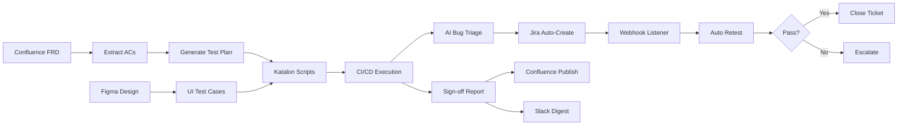

# 🤖 QA AI Automation

> End-to-end AI-supervised QA pipeline — from FRD to release sign-off.
> You supervise. The agent executes.

## Architecture



## Pipeline Stages

| Stage | What it does | Your role |
|-------|-------------|-----------|
| **1–2** FRD → Test Plan | Reads Confluence FRD, extracts ACs, generates test plan | Review plan |
| **3** Figma → UI Tests | Analyses designs via Claude vision, generates CSS assertions | Review diffs |
| **4** Katalon Scripts | Generates Groovy scripts + CSV test data + custom keywords | Verify selectors |
| **5** CI/CD Execution | GitHub Actions triggers runs, parallel browsers | Monitor dashboard |
| **6** Bug Triage | AI classifies failures, dedupes, raises Jira tickets | Confirm blockers |
| **7** Sign-off Report | Aggregates metrics, writes narrative, publishes to Confluence | Approve release |

## Quick Start

### 1. Clone & Install

```bash
git clone <your-repo-url>
cd qa-ai-automation
python -m venv venv
source venv/bin/activate
pip install -r requirements.txt
```

### 2. Configure

```bash
cp .env.example .env
# Fill in all API keys and project IDs
```

**Required API keys:**
- **Anthropic** — `ANTHROPIC_API_KEY` from [console.anthropic.com](https://console.anthropic.com)
- **Jira** — `JIRA_API_TOKEN` from [Atlassian Account Settings](https://id.atlassian.com/manage-profile/security/api-tokens)
- **Confluence** — Same Atlassian token works
- **Figma** — `FIGMA_TOKEN` from [Figma Settings](https://www.figma.com/developers/api)
- **Katalon** — `KATALON_API_KEY` from TestOps Settings
- **Slack** — `SLACK_WEBHOOK_URL` from [Slack App Incoming Webhooks](https://api.slack.com/messaging/webhooks)
- **GitHub** — `GITHUB_TOKEN` with repo and workflow permissions

### 3. Run Individual Tools

```bash
# Stage 1–2: FRD → Test Plan
python tools/frd_extractor.py --page-id YOUR_CONFLUENCE_PAGE_ID --epic-key QA-100

# Stage 3: Figma → UI Test Cases
python tools/figma_analyzer.py --file-key YOUR_FIGMA_FILE_KEY --frame-id FRAME_NODE_ID --feature Login

# Stage 4: Generate Katalon Scripts
python tools/katalon_generator.py --ac-file test_plan_acs.json --feature Login --katalon-project /path/to/YourKatalonProject --suite smoke

# Stage 6: Bug Triage (on existing results)
python tools/bug_triage.py --results path/to/katalon_results.json --environment staging

# Stage 7: Sign-off Report
python tools/signoff_report.py --sprint-id SPRINT-42 --fix-version v2.3.0
```

### 4. Run the Agent

```bash
# Custom goal
python agent/orchestrator.py goal "New FRD published for checkout redesign. Handle full QA setup."

# Handle a new FRD
python agent/orchestrator.py new-frd \
  --page-id 123456789 \
  --epic-key QA-100 \
  --figma-file abc123 \
  --figma-frame 456:789

# Handle test results
python agent/orchestrator.py results \
  --results-path Reports/latest.json \
  --sprint-id SPRINT-42 \
  --fix-version v2.3.0
```

### 5. Start the Webhook Server

```bash
python agent/webhook_server.py --port 8000
# Server listens at http://localhost:8000

# Endpoints:
# POST /jira-webhook      — Jira status change events
# POST /retest-result      — CI retest results
# POST /trigger-pipeline   — Manual test run trigger
# GET  /health             — Health check
```

**Jira Webhook Setup:**
1. Go to Jira Settings → System → Webhooks
2. Create webhook pointing to `https://your-server:8000/jira-webhook`
3. Select events: Issue Updated, Issue Created
4. Filter: `project = QA AND issuetype = Bug`

### 6. CI/CD Integration

Copy `.github/workflows/katalon.yml` to your repo. Add these GitHub Secrets:

| Secret | Value |
|--------|-------|
| `ANTHROPIC_API_KEY` | Your Claude API key |
| `JIRA_BASE_URL` | `https://yourco.atlassian.net` |
| `JIRA_EMAIL` | Your Atlassian email |
| `JIRA_API_TOKEN` | Your Jira API token |
| `CONFLUENCE_BASE_URL` | `https://yourco.atlassian.net/wiki` |
| `CONFLUENCE_EMAIL` | Your Atlassian email |
| `CONFLUENCE_API_TOKEN` | Your Confluence token |
| `KATALON_API_KEY` | Your Katalon API key |
| `SLACK_WEBHOOK_URL` | Your Slack webhook URL |

## Project Structure

```
qa-ai-automation/
├── config.py                          # Central configuration
├── .env.example                       # Environment variable template
├── requirements.txt                   # Python dependencies
│
├── tools/                             # Individual tool modules
│   ├── jira_client.py                 # Jira REST API wrapper
│   ├── confluence_client.py           # Confluence REST API wrapper
│   ├── slack_notifier.py              # Slack Block Kit notifications
│   ├── frd_extractor.py               # Stage 1–2: FRD → Test Plan
│   ├── figma_analyzer.py              # Stage 3: Figma → UI Tests
│   ├── katalon_generator.py           # Stage 4: Katalon Scripts
│   ├── bug_triage.py                  # Stage 6: AI Bug Triage
│   └── signoff_report.py             # Stage 7: Sign-off Report
│
├── agent/                             # Agent orchestration layer
│   ├── orchestrator.py                # Claude tool-calling agent
│   ├── webhook_server.py              # FastAPI Jira webhook server
│   └── escalation.py                  # Escalation rules engine
│
├── scripts/                           # CI/CD scripts
│   ├── triage_and_gate.py             # Pipeline gate script
│   └── signoff_pipeline.py            # Report generation script
│
├── .github/workflows/
│   └── katalon.yml                    # GitHub Actions CI/CD
│
└── mcp_config/
    └── mcp.json                       # Cursor MCP server config
```

## Escalation Rules

| Situation | Agent Handles | Escalates to You |
|-----------|:---:|:---:|
| Retest passes | ✅ Close ticket | — |
| Retest fails (1st time) | ✅ Reopen, notify dev | — |
| Retest fails (2nd time) | — | ⚠️ Escalate |
| Severity upgrade needed | — | ⚠️ Escalate |
| Bug open 24h, no response | ✅ Ping dev | — |
| Bug open 48h, no response | ✅ Ping dev lead | — |
| Bug open 72h, still open | — | ⚠️ Escalate |
| All blockers resolved | ✅ Clear gate | — |
| Critical path failure | — | 🔴 Escalate immediately |

## Cursor + MCP Setup

Copy `mcp_config/mcp.json` to your Cursor MCP settings and fill in your tokens.
This gives Cursor live access to your Jira, Confluence, GitHub, Figma, and filesystem
while building — so generated code uses your real field names and project structure.

## License

Confidential — Internal use only.
